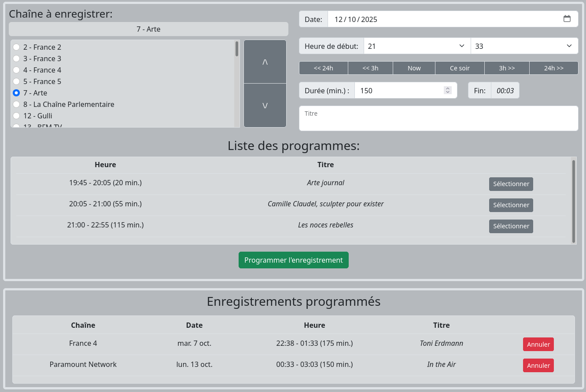

## Présentation



`Freeboxrec` est une application pour Linux permettant de programmer
des enregistrements de flux vidéos diffusés sur le réseau dans l'offre
Freebox.

## Installation

L'application est en Python, elle utilise les commandes du démon `atd`
pour programmer des tâches à venir, et `ffmpeg` pour enregistrer les
flux.

* Installer les paquets requis :

```
sudo apt-get install git python3-pip python3-virtualenv at ffmpeg
```

* Récupérer le code :

```
git clone https://github.com/saffroy/freeboxrec
```

* Préparer un environnement d'exécution, par exemple ici sous `venv` :
 
```
cd freeboxrec
virtualenv -p python3 venv
source venv/bin/activate
pip install -r requirements.txt
```

* Dans cet environnement, lancer l'application en lui indiquant sur
  quel port tourner, et dans quel répertoire stocker les
  enregistrements :

```
source venv/bin/activate
env FLASK_APP=app.py \
  FREEBOXREC_OUTDIR=/path/to/folder/ \
  flask run --port 8080
```

## Utilisation

Depuis un navigateur, accéder à l'interface web de l'application sous
`http://localhost:8080/`, puis :

* Sélectionner une chaîne.

* Sélectionner une date et une heure.

* Dans la liste des programmes, en sélectionner un (bouton
  "Sélectionner") : cela renseigne précisément les champs heure, durée
  et titre, qui peuvent encore être modifiés manuellement.

* Appuyer sur le bouton "Programmer l'enregistrement".
